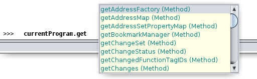

# peleus

intro to ghidra scripting guide

===========================

# Catalog

* [Installing](#installing)
* [Directory Structure](#directory-structure)
* [FlatProgramAPI](#flatprogramapi)
* [Headless Mode](#headless-mode)
* [Decompiler](#decompiler)
* [Pcode Emulator](#pcode-emulator)
* [Errata](#errata)
* [Cool Projects](#cool-projects)

## Installing

Download the latest zipped up version from [ghidra-sre.org](https://ghidra-sre.org/ghidra_9.1.2_PUBLIC_20200212.zip)

Download a compatible JDK version (generally version 11) from [https://jdk.java.net/archive/](https://download.java.net/java/GA/jdk11/9/GPL/openjdk-11.0.2_linux-x64_bin.tar.gz)

Edit your `~/.bashrc` to add the JDK/bin to your PATH with the following line:

```
export PATH=/opt/jdk-11.*/bin:$PATH
```

After unzipping ghidra, launch with `./ghidraRun`

## Directory Structure

Wherever the folder `ghidra_scripts` is found, you can place scripts into and find in the Script Manager / Code Browser.

Generally, the user's home directory is most convenient: `~/ghidra_scripts`. This folder should be created after running ghidra once.

Wherever you've unzipped ghidra, the java docs for the API can be found in:

​	`docs/GhidraAPI_javadoc.zip`. 

Unzip the file to get the `api` folder where you can read the java docs.

## FlatProgramAPI

Java docs location: `docs/api/ghidra/program/flatapi/FlatProgramAPI.html`

Online mirror is at: https://ghidra.re/ghidra_docs/api/index.html

These functions can be run without creating any objects and is usually what to start with to get the objects you need.

### Important Objects

* TaskMonitor - object used to show progress and for canceling an operation via the GUI
* ProgramDB - object used to represent the currentProgram. Most other objects are obtained via some form of `currentProgram.get*()` method
* FunctionDB - object used to represent a defined function
  * To get a list of all functions, get a FunctionIteratorDB from the listing object with: `currentProgram.getListing().getFunctions(true)`
* Address - object used to represent a location in the program
  * To get a specific Address object from a string do: `parseAddress("08048585")` where 0x08048585 is the address in the binary

* Reference - object used to represent a "from" address
* Data - object used to represent data at an address

#### Listing / Managers / Factories 

```
currentProgram.getListing()
currentProgram.getMemory()
currentProgram.getProgramUserData()
currentProgram.getFunctionManager()
currentProgram.getAddressFactory()
```

When in doubt, dump the object to view its member variables and instance methods:

```python
"""
Purpose: Dump object attributes to console
Input: 	 obj    some object whose type and attributes are unclear
Note: Especially helpful for learning how to interact with Ghidra API
"""
def dump(obj):
    if debug:
        printf("[+] Dumping object attributes: %s\n", obj)
        printf("[+] Object type: %s\n", str(type(obj)))
        printf("[+] Attributes:\n")
    for attr in dir(obj):
        try:
            printf("\t%-30s: %s\n", attr, getattr(obj,attr))
        except:
            # Write only object, cannot get value
            printf("\t%-30s: %s\n", attr, "ERROR: Cannot get value")
```

Or use the auto-complete in ghidra's python interpreter by pressing tab.



#### Xrefs

Coming from IDA, we may wonder where are the cross references?

Fear not, we use `getReferencesTo(Address)` to get a list of references to the user-specified address.

## headless mode

The headless analyzer script is located in `support/analyzeHeadless`. 

There are a lot of flags for running it as can be seen [here](https://ghidra.re/ghidra_docs/analyzeHeadlessREADME.html)

Some simple examples is to do:

* `analyzeHeadless [project_directory] [project_name] -import [directory_of_binaries]` - Import a directory of binaries into a new project and analyze
* `analyzeHeadless [project_directory] [project_name] -process [project_file]` - Process a specific file imported into an existing project.

**useful flags**

`-preScript [ghidra_script_name]` - Run a specific ghidra script **before** the default analyze scripts. 

`-postScript [ghidra_script_name]` - Run a specific ghidra script **after** the default analyze scripts.

Note: the `[ghidra_script_name]` is not the full file path, it will grab the name from a ghidra_scripts folder.

## decompiler

look at ghidra.app.decompiler.flatapi for some accessible methods

The decompiler is a C++ binary located in `Ghidra/Features/Decompiler/os/linux64/decompile`.

The program takes XML input via stdin. Ghidra will shell-out decompilation to this binary.

The source code can be found at: https://github.com/NationalSecurityAgency/ghidra/tree/master/Ghidra/Features/Decompiler/src/decompile/cpp

An important file to read is [docmain.hh](https://github.com/NationalSecurityAgency/ghidra/tree/master/Ghidra/Features/Decompiler/src/decompile/cpp/docmain.hh) which describes the 14 steps of the decompiler analysis engine in great detail.

## pcode emulator

my guess is to look at ghidra.pcode.emulate 

**some examples:**

* https://github.com/TheRomanXpl0it/ghidra-emu-fun - ghidrascript frontend of pcode emulator
* https://github.com/kc0bfv/pcode-emulator - pcode emulator

## sleigh

[sleigh](https://ghidra.re/courses/languages/html/sleigh.html) is ghidra's processor specification language

relevant processor spec files (which are mostly XML) are located in: `Ghidra/Processors/`

Some of the relevant file conventions are:

* .ldefs - processor metadata
* .cspec - calling conventions of the processor
* .slaspec - declaration of endianness and stuff
* .sla - compiled form for ELF relocations

## Errata

* allegedly, the regex in `docs/api/search.js` can be changed to match more stuff in the web search of the java docs.
* at the moment, there is no good way to change the graph view colors from the API. so ghetto dark mode exists by going to `Edit -> Tool Options -> Tool -> Use Inverted Colors`
* generally, the workflow is to prototype a script in python and if it becomes a bigger thing, develop the plugin in java

## cool projects

**synchronize debugging with disassembly**

* https://github.com/bootleg/ret-sync - synchronize (WinDbg/GDB/LLDB/OllyDbg2/x64dbg) debugging session with ghidra
* https://github.com/comsecuris/gdbghidra - visual bridge between GDB and ghidra

**improving analysis**

* https://github.com/felberj/gotools - ghidra plugin for reversing golang
* https://github.com/fuzzywalls/ghidra_scripts - devttys0 IDA plugins ports to ghidra
* https://github.com/astrelsky/ghidra-cpp-class-analyzer - ghidra c++ class and RTTI analyzer
* https://github.com/cmu-sei/pharos/tree/master/tools/ooanalyzer/ghidra/OOAnalyzerPlugin - object oriented C++ analysis plugin for ghidra
* https://github.com/NWMonster/Applysig - apply IDA FLIRT signatures for ghidra
* https://github.com/allsafecybersecurity/lazyghidra - quality of life scripts to do data type conversions
* https://github.com/allsafecybersecurity/headless_scripts - some headless scripts to output decompiler and disassembly to file
* https://github.com/ghidraninja/ghidra_scripts - various analyze scripts, binwalk and yara for crypto constants

**using ghidra for other tools**

* https://github.com/radareorg/r2ghidra-dec - ghidra decompiler for radare2
* https://github.com/cseagle/blc - ghidra decompiler for ida (c++ bindings)
* https://github.com/Cisco-Talos/GhIDA - ghidra decompiler for ida (shells out)
* https://github.com/cisco-talos/ghidraaas - ghidra as a service (REST API)
* https://github.com/vdoo-connected-trust/ghidra-pyi-generator - generate .pyi stubs for ghidra api for use with pycharm autofill

**UI colors**

* https://github.com/slinderud/ghidra-config - monokai for ghidra
* https://github.com/alecnunn/ghidorah - ghidra color change plugin
* https://github.com/elliiot/ghidra_darknight - ghidra dark theme

**misc**

* https://github.com/deepdivesec/ghidra_install - bash script to install ghidra